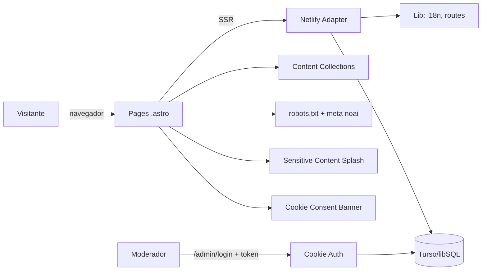
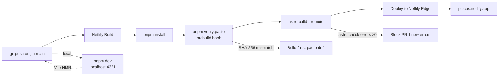
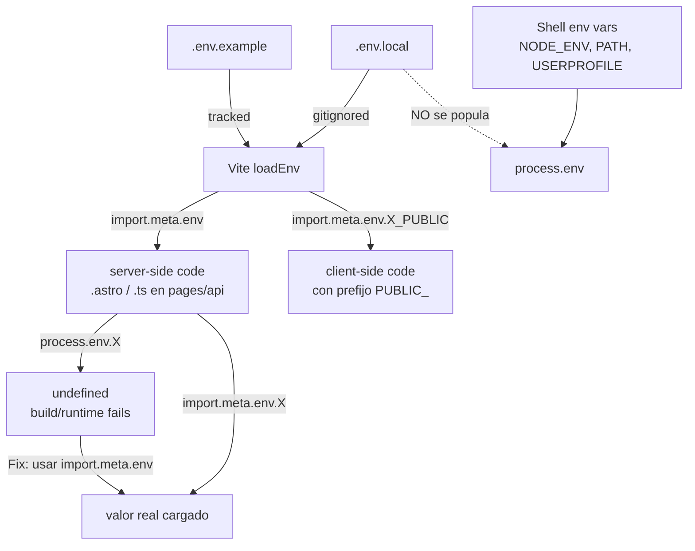
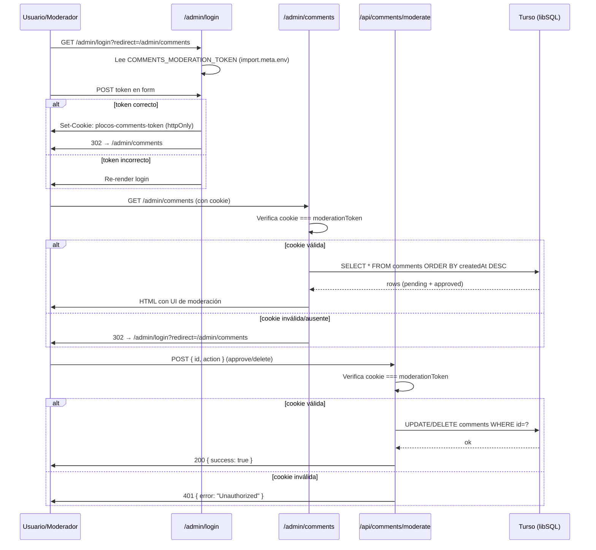
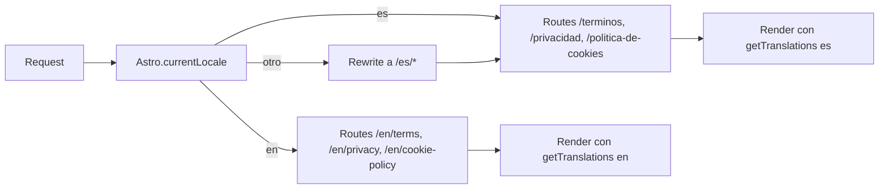
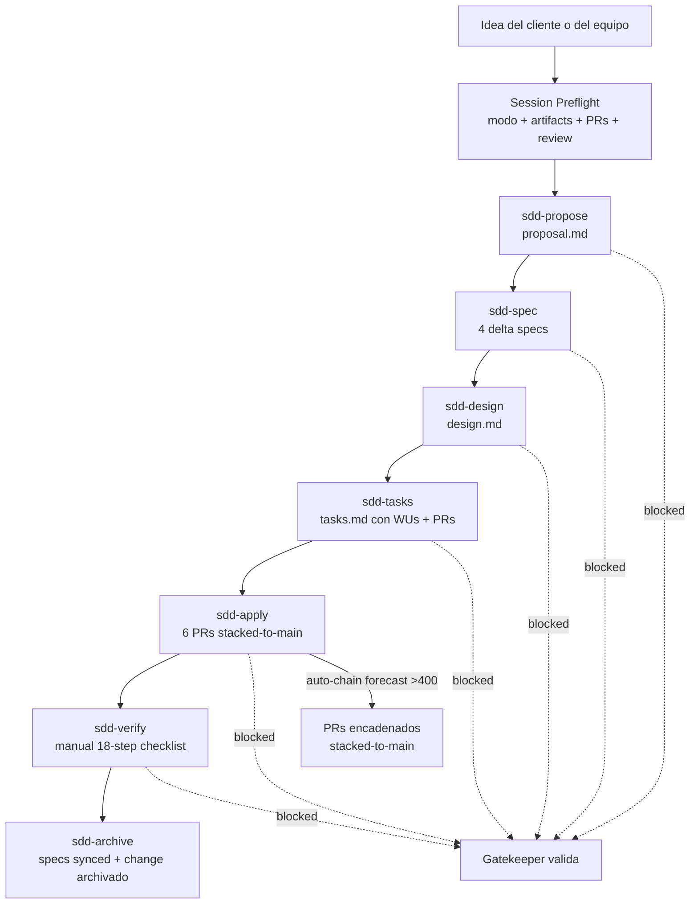

# Arquitectura de PLOCOS

> Documento vivo: describe la arquitectura actual del proyecto y los patrones que rigen su evolución.

## Stack

| Capa | Tecnología | Versión |
|---|---|---|
| Framework | Astro (output: `server`) | 5.16.0 |
| Adapter | `@astrojs/netlify` | 6.6.2 |
| DB | libSQL (Turso) + Drizzle ORM | @libsql/client 0.7 |
| Estilos | Tailwind CSS + Flowbite | 3.4 + 4.0 |
| UI islands | Vue + React + Preact | mixto |
| i18n | Astro nativo (es-CO primary, en fallback) | builtin |
| Env vars | `.env.local` → `import.meta.env` | Vite 6 |
| Tests | manual + `astro check` + `verify:pacto` SHA-256 | — |

## Vista de alto nivel



## Estructura del proyecto

```mermaid
graph TD
    Root[plocos_astro/] --> Src[src/]
    Root --> Public[public/]
    Root --> Openspec[openspec/]
    Root --> Docs[docs/]
    Root --> Scripts[scripts/]

    Src --> Layouts[layouts/]
    Src --> Pages[pages/]
    Src --> Components[components/]
    Src --> Lib[lib/]
    Src --> Content[content/]
    Src --> PagesApi[pages/api/]
    Src --> PagesAdmin[pages/admin/]

    Layouts --> BaseLayout[BaseLayout.astro<br/>shell + cookie banner + splash]
    Pages --> PáginasEstáticas[/terminos, /privacidad, etc.]
    Pages --> PagesEn[en/* mirror]
    Pages --> PagesBlog[blog/[slug]]
    Pages --> PagesCategorias[categorias/[slug]]
    PagesAdmin --> Login[login.astro]
    PagesAdmin --> Comments[comments.astro]
    PagesApi --> CommentsAPI[/api/comments]
    PagesApi --> ModerateAPI[/api/comments/moderate]
    PagesApi --> SavePostAPI[/api/save-post]

    Lib --> i18n[lib/i18n.ts<br/>es-CO + en bundles]
    Lib --> db[lib/db.ts<br/>Drizzle + libSQL]
    Lib --> routes[lib/routes.ts]

    Content --> Categories[6 categories]
    Content --> Posts[~150 posts]
    Content --> PactoData[_data/pacto.{es,en}.json]

    Public --> Logo[logo.svg + flags/]
    Public --> Robots[robots.txt]

    Openspec --> Specs[specs/<br/>7 active capabilities]
    Openspec --> Changes[changes/<br/>archived changes]

    Docs --> DocsGuides[guias + diagramas]

    Scripts --> Verifier[verify-pacto-body.mjs<br/>SHA-256 pacto]
    Scripts --> PactoFixture[__fixtures__/pacto-canonical.json]
```

## Pipeline de build y deploy



## Variables de entorno (lección Vite 6)

> **Regla crítica**: en Astro 5 + Vite 6, las vars de `.env.local` **NO** se exponen en `process.env`. Solo en `import.meta.env`.



## Flujo de moderación de comentarios



## Routing i18n



## Ciclo de Spec-Driven Development (SDD)

Este proyecto sigue SDD. Toda propuesta de cambio pasa por 6 fases antes de merge.



## Decisiones arquitectónicas vigentes

| Decisión | Razón | Cambio | Archivo |
|---|---|---|---|
| `import.meta.env` para `.env.local` | Vite 6 no popula `process.env` | `7783e76` | `src/lib/db.ts`, `src/pages/admin/comments.astro`, `src/pages/api/comments/moderate.ts` |
| Pacto body en `src/content/_data/pacto.{es,en}.json` | Permite CMS futuro sin tocar i18n.ts | `8dc7f6c` | `src/content/_data/` |
| Verifier SHA-256 byte-level del pacto | Garantiza que el texto literal del cliente no mute | `27aee9f` | `scripts/verify-pacto-body.mjs` |
| `*.json text eol=lf` en `.gitattributes` | Evita que `core.autocrlf=true` rompa el SHA-256 | `27aee9f` | `.gitattributes` |
| 8 secciones en pacto (I–VIII) | Texto literal del cliente 2026-09-02 | `8dc7f6c` | `openspec/specs/pacto-lectura/spec.md` |
| Netlify Adapter (no Node server) | Deploy serverless, scaling automático | `f4074a9` | `astro.config.mjs` |
| Cookie httpOnly para auth de moderación | Evita token en URL, previene XSS | `a2e5b8e` | `src/pages/admin/login.astro` |

## Próximos pasos arquitectónicos (no iniciados)

- **Item 4 del cliente** (autonomía editorial + audiovisual + CMS): punteado a change separado.
- **Limpiar `av` y `editor` interfaces** en `Translation`: declaradas en PR1 pero sin UI consumer (cruft).
- **Migrar 24 errores pre-existentes** en `src/pages/blog/[...slug].astro` (ya reducidos a 0 en `f9ef662`).
- **8 markers `[EN: TODO legal review]`**: pendiente revisión de abogado colombiano.
- **Home.tags pills** (Ensayos Lumínicos / Poética Visual / Bitácora Crítica): sin decisión.

## Ver también

- `docs/diagramas/dev/` — diagramas técnicos detallados
- `docs/diagramas/user/` — diagramas para el cliente y usuario final
- `openspec/specs/` — fuente de verdad de las capacidades activas
- `openspec/changes/archived/` — historial completo de cambios

---

Última actualización: 2026-09-05
Versión del proyecto: 0.1.45
