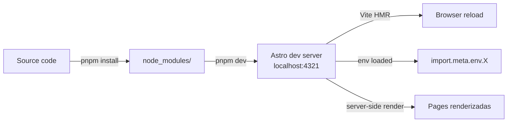
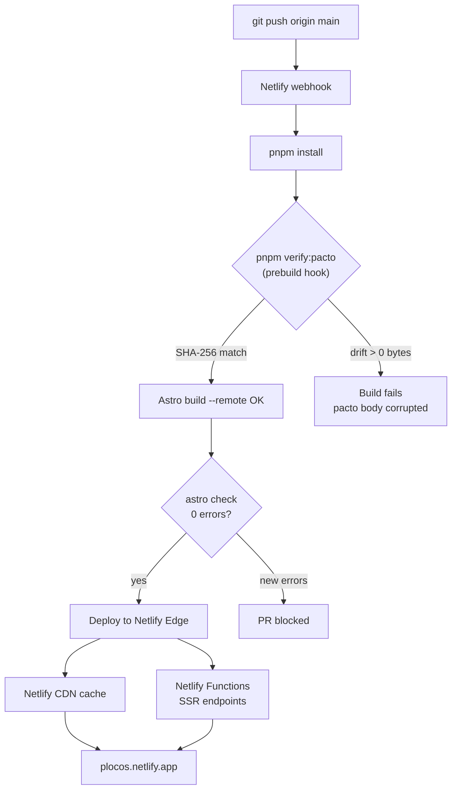
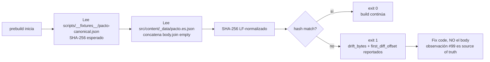

# Pipeline de Build y Deploy

## Local dev

## Build de producción

## Prebuild hook: verify:pacto

El hook `prebuild` corre `pnpm verify:pacto` antes de cada build. Garantiza que el texto literal del pacto no mute.

**Nunca** edites `pacto.es.json` o `pacto.en.json` a mano para "arreglar" un drift. La fuente de verdad es observación #99 en Engram. Si el hash cambia, el código que consume el body está mal.

## Variables de entorno en build vs dev

| Fase | Origen de env vars | API disponible |
|---|---|---|
| `pnpm dev` (local) | `.env.local` + shell | `import.meta.env.X` ✓ |
| `astro build` (local) | `.env.local` + shell | `import.meta.env.X` ✓ |
| `astro build --remote` | `.env.local` + shell | `import.meta.env.X` ✓ |
| Netlify build | Netlify environment UI | `import.meta.env.X` ✓ |
| Netlify runtime (SSR) | Netlify environment UI | `import.meta.env.X` ✓ |

**Importante**: Netlify NO lee `.env.local`. Las vars deben estar configuradas en Netlify UI (Site settings → Environment variables).

Última actualización: 2026-09-05
