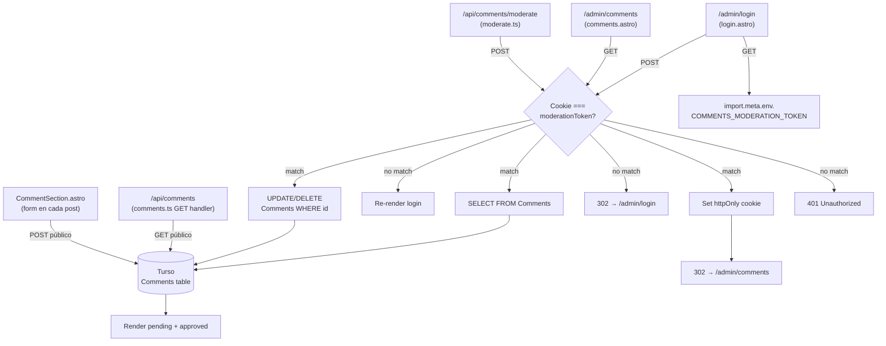
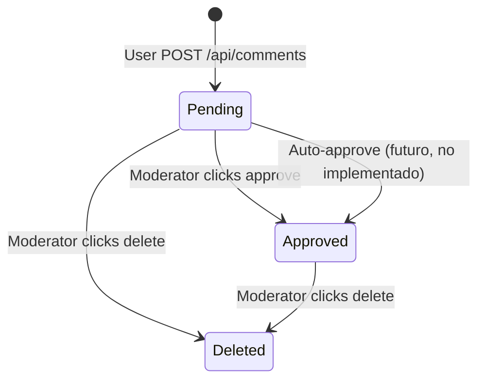
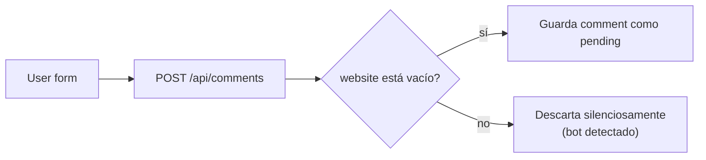

# Flujo de Moderación de Comentarios — Vista de Desarrollo

## Arquitectura



## Schema de la tabla Comments

```typescript
// src/lib/db/schema.ts (resumen)
Comments {
  id: number (PK, autoincrement)
  postSlug: string (index)
  locale: 'es' | 'en'
  name: string (max 120)
  email: string | null (max 160)
  message: string (max 2000, min 8)
  website: string | null (anti-spam honeypot)
  approved: 0 | 1 (default 0 → pending)
  createdAt: Date
}
```

## Estados de un comentario



## Configuración requerida

### Local (`/admin/login`)
1. `pnpm dev`
2. Asegúrate de que `.env.local` tiene `COMMENTS_MODERATION_TOKEN=<tu-token>`
3. Abre `http://localhost:4321/admin/login`
4. Pega el token → cookie de sesión se guarda (httpOnly, secure en prod)

### Producción (Netlify)
1. Site settings → Environment variables
2. Agregar `COMMENTS_MODERATION_TOKEN` con el MISMO valor que usas local
3. Netlify redeploy → cookie ya funciona sobre HTTPS

## Endpoints públicos (sin auth)

| Método | Ruta | Función |
|---|---|---|
| `GET` | `/api/comments?slug=X&locale=Y` | Devuelve comments aprobados (no pending) |
| `POST` | `/api/comments` | Crea comment en estado `pending: 0` |

## Endpoints admin (requieren cookie)

| Método | Ruta | Función |
|---|---|---|
| `GET` | `/admin/login` | Form de login |
| `POST` | `/admin/login` | Verifica token, setea cookie |
| `GET` | `/admin/comments` | Lista pending + approved |
| `POST` | `/api/comments/moderate` | Aprueba o elimina comment |

## Anti-spam (honeypot)

`CommentSection.astro` incluye un campo `website` invisible para humanos (vía CSS). Si un bot lo llena, el POST es rechazado silenciosamente.



## Lo que NO está implementado

- ❌ Rate limiting por IP (futuro: usar Netlify Edge Functions)
- ❌ Notificación al moderador cuando hay nuevos pending (futuro: webhook a email/Slack)
- ❌ Edición de comments (solo approve/delete)
- ❌ Comentarios anidados (threading)
- ❌ Paginación en `/admin/comments` (si hay >100 pending, se cargan todos)

## Seguridad actual

| Capa | Estado |
|---|---|
| Auth | Token único via cookie httpOnly ✓ |
| HTTPS | Cookie secure en prod ✓ |
| CSRF | ⚠️ no implementado (mismo origen ayuda, pero falta token de form) |
| XSS | ✅ React/Vue escapan por default; markdown se sanitiza |
| Honeypot | ✓ website field |
| Rate limit | ❌ ausente |

Última actualización: 2026-09-05
