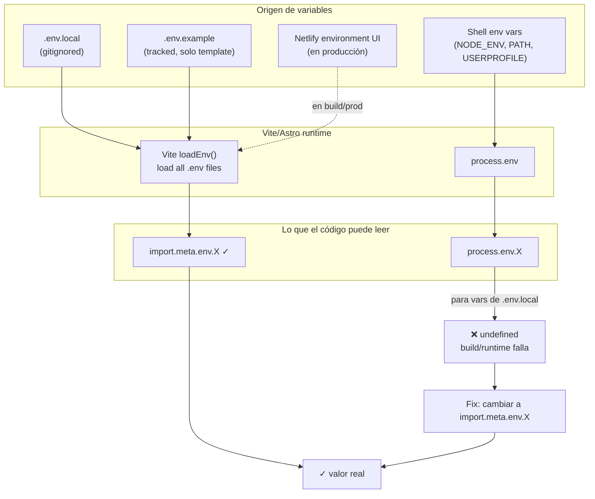

# Variables de Entorno — Lección Vite 6

## El problema que nos costó una hora

Astro 5 + Vite 6 cargan `.env.local` en `import.meta.env` pero **NO** en `process.env`. El código legacy de moderación usaba `process.env.X` y siempre veía `undefined`.



## Tabla de referencia rápida

| API | Carga `.env.local`? | Notas |
|---|---|---|
| `import.meta.env.X` | ✅ sí | Recomendado en Astro 5+. Funciona client + server. |
| `import.meta.env.PUBLIC_X` | ✅ sí, además expone a cliente | Solo para vars que el cliente necesita. |
| `process.env.X` | ❌ no (excepto NODE_ENV, PATH, etc.) | Solo vars del shell. |
| `process.env.NODE_ENV` | ✅ sí (lo setea Node al start) | `'development'` o `'production'`. |

## Reglas

1. **Siempre `import.meta.env.X`** para vars de `.env.local`.
2. **`process.env.NODE_ENV`** es válido (lo setea Node automáticamente).
3. **Prefijo `PUBLIC_`** solo para vars que se necesitan en el bundle del cliente.
4. **NO usar `dotenv.config()`** manualmente — Vite ya carga los archivos.
5. **Netlify**: las vars deben estar en Site settings → Environment variables (no en `.env.local`).

## Cómo debuggear si una var no se ve

Crea un endpoint temporal:

```typescript
// src/pages/api/debug-env.ts (NO prefijar con _ porque no se vuelve ruta)
import type { APIRoute } from 'astro';
import { writeFileSync } from 'fs';

export const prerender = false;

export const GET: APIRoute = async () => {
  writeFileSync(
    'C:/temp/env-debug.txt',
    `process.env.ASTRO_DB_REMOTE_URL = ${JSON.stringify(process.env.ASTRO_DB_REMOTE_URL)}\n` +
    `import.meta.env.ASTRO_DB_REMOTE_URL = ${JSON.stringify(import.meta.env.ASTRO_DB_REMOTE_URL)}\n`
  );
  return new Response('OK');
};
```

Si `process.env.X` es undefined pero `import.meta.env.X` tiene valor → usa `import.meta.env`. Borra el endpoint antes de commit.

## Archivos de env en este proyecto

```
plocos_astro/
├── .env.example          ← tracked, solo documenta COMMENTS_MODERATION_TOKEN
├── .env.local            ← gitignored, tiene 7 vars reales (Turso, Algolia, tokens)
├── .gitignore            ← gitinea .env, .env.local, .env.production
└── .gitattributes        ← *.json text eol=lf (para que SHA-256 del pacto sea estable)
```

**Nunca** subas `.env.local` al repo. Si lo haces por accidente, rota TODAS las credenciales inmediatamente (Turso tokens, Algolia keys, etc.).

Última actualización: 2026-09-05 (post-mortem del bug 2026-09-05)
