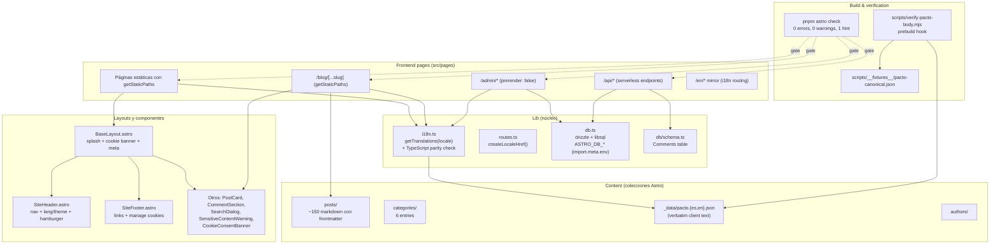

# Estructura del Proyecto — Vista de Desarrollo

## Convenciones de organización

- **`src/pages/`** — solo rutas. Sin lógica de negocio. Delegan a `src/lib/`.
- **`src/lib/`** — módulos singleton sin estado. Solo lectura del ambiente (`import.meta.env`).
- **`src/content/`** — todo el contenido editable como colección Astro (typed via Zod).
- **`src/components/`** — componentes reutilizables. Props explícitos, sin estado global.
- **`scripts/`** — scripts ejecutables de build/dev/verificación. No importan código de `src/`.
- **`openspec/specs/`** — fuente de verdad de las capacidades activas.
- **`openspec/changes/`** — cambios en curso y archivados.

## Anti-patrones (NO hacer)

- ❌ Inline de strings traducibles en `.astro`. Siempre via `getTranslations()`.
- ❌ Acceso a DB en componentes de UI. Siempre en `src/lib/db.ts`.
- ❌ Hardcoded URLs. Siempre via `createLocaleHref()`.
- ❌ `process.env.X` para vars de `.env.local`. Siempre `import.meta.env.X`.
- ❌ Modificar `src/lib/i18n.ts` para añadir secciones legales. Usar `src/content/_data/*.json`.

Última actualización: 2026-09-05
