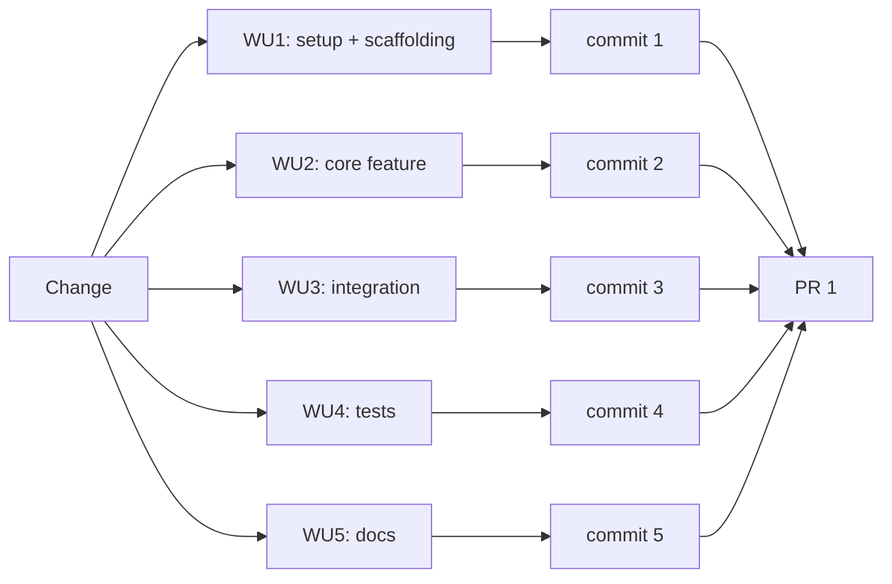
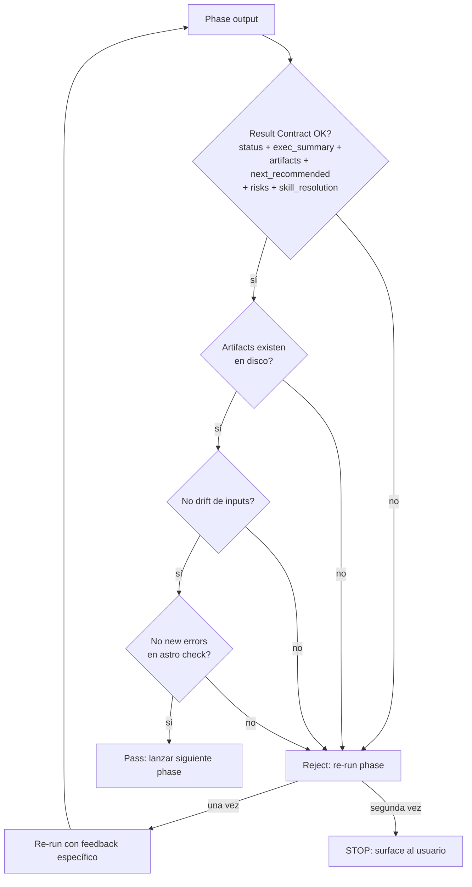

# Ciclo de Spec-Driven Development (SDD)

## Flujo de un change

```mermaid
flowchart TD
    Idea[Idea del cliente o equipo] --> Preflight[Session Preflight<br/>modo + artifacts + PRs + review]
    Preflight -->|interactivo| AskUser[Preguntar 4 grupos:<br/>Pace, Artifacts, PRs, Review]
    AskUser --> Cachear[Cachear preflight]
    Preflight -->|auto| Cachear

    Cachear --> InitGuard{sdd-init<br/>ejecutado?}
    InitGuard -->|no| Init[sdd-init<br/>detecta stack + testing]
    InitGuard -->|sí| NewChange
    Init --> NewChange[/sdd-new<br/>genera propuesta]

    NewChange --> Propose[sdd-propose<br/>proposal.md]
    Propose --> Spec[sdd-spec<br/>4 delta specs]
    Spec --> Design[sdd-design<br/>design.md]
    Design --> Tasks[sdd-tasks<br/>tasks.md con WUs + PRs]
    Tasks --> Forecast{Review Workload<br/>Forecast}
    Forecast -->|>400 líneas| ChainedDecide{Estrategia<br/>PRs}
    Forecast -->|<400 líneas| Apply

    ChainedDecide -->|auto-chain| Chain[Encadenar PRs<br/>stacked-to-main]
    ChainedDecide -->|ask-on-risk| AskChain[Preguntar al usuario]
    ChainedDecide -->|single-pr| Single[Una sola PR]
    Chain --> Apply
    AskChain --> Apply
    Single --> Apply

    Apply[sdd-apply<br/>6 PRs o las que apliquen] --> Verify[sdd-verify<br/>18-step manual checklist]
    Verify --> Archive[sdd-archive<br/>specs synced + change archivado]

    Archive --> Done[✓ Change cerrado]
    Done -.->|git push origin main| Remote[Visible en GitHub]

    Propose -.->|gatekeeper FAIL| RePropose[Re-run con feedback]
    Spec -.->|gatekeeper FAIL| ReSpec
    Design -.->|gatekeeper FAIL| ReDesign
    Tasks -.->|gatekeeper FAIL| ReTasks
    Apply -.->|gatekeeper FAIL| ReApply
```

## Tipos de change

| Tipo | Sufijo en nombre | Ejemplo |
|---|---|---|
| Nueva capacidad | `cms-editorial-unificado` | (descartado en 2026-09-05) |
| Modificación | `pacto-lectura` | sí |
| Refactor | `refactor-i18n-bundles` | sí |
| Bugfix | `fix-astro-check-errors` | sí |
| Compliance | `consentimiento-y-marco-legal` | sí (change anterior, archivado 2026-08-20) |

## Work Units (WUs)

Cada change se divide en WUs (Work Units). Cada WU = un commit atómico.



## Gatekeeper (validación automática)



## Modo automático vs interactivo

| Modo | Comportamiento |
|---|---|
| `auto` | Phases corren back-to-back. Gatekeeper valida entre fases. Solo interrumpe al usuario si el gatekeeper detecta un problema real. |
| `interactivo` | Después de cada fase, muestra el resultado y pide luz verde antes de la siguiente. |

## Selección de modelo

Los agentes sdd-* tienen modelos configurables via `opencode.json`. Por ejemplo:

```json
{
  "agent": {
    "sdd-apply": {
      "model": "minimax/MiniMax-M3"
    }
  }
}
```

Si tu plan de tokens tiene límites, considera usar un modelo más barato para `sdd-apply` (que es el más token-heavy).

## Cambios archivados en este proyecto

```
openspec/changes/
├── archived/
│   ├── consentimiento-y-marco-legal/  (2026-08-20, 8 WUs)
│   └── pacto-cliente-y-autonomia-contenido/  (2026-09-05, 8 WUs)
└── (vacío, sin cambios en curso)
```

Cada carpeta archivada contiene: `proposal.md`, `design.md`, `tasks.md`, `specs/*.md`, `archive-report.md`.

## Cambios NO archivados / scoped out

- **cms-editorial-unificado** (Decap CMS): implementado en pr3, revertido por decisión del cliente. Spec queda en `openspec/changes/archived/pacto-cliente-y-autonomia-contenido/specs/cms-editorial-unificado/spec.md` como scoped-out.
- **coleccion-audiovisuales**: nunca implementado. Spec queda en archived como scoped-out.

Estos specs existen como **decisión documentada** para futuro. Cuando se reactive, abrir un nuevo SDD change que los reutilice.

Última actualización: 2026-09-05
