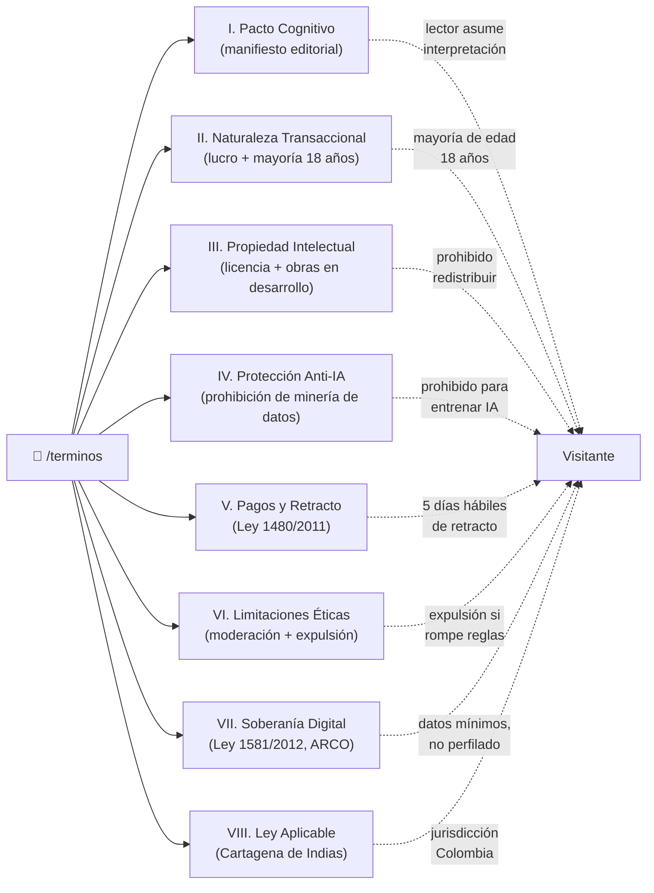
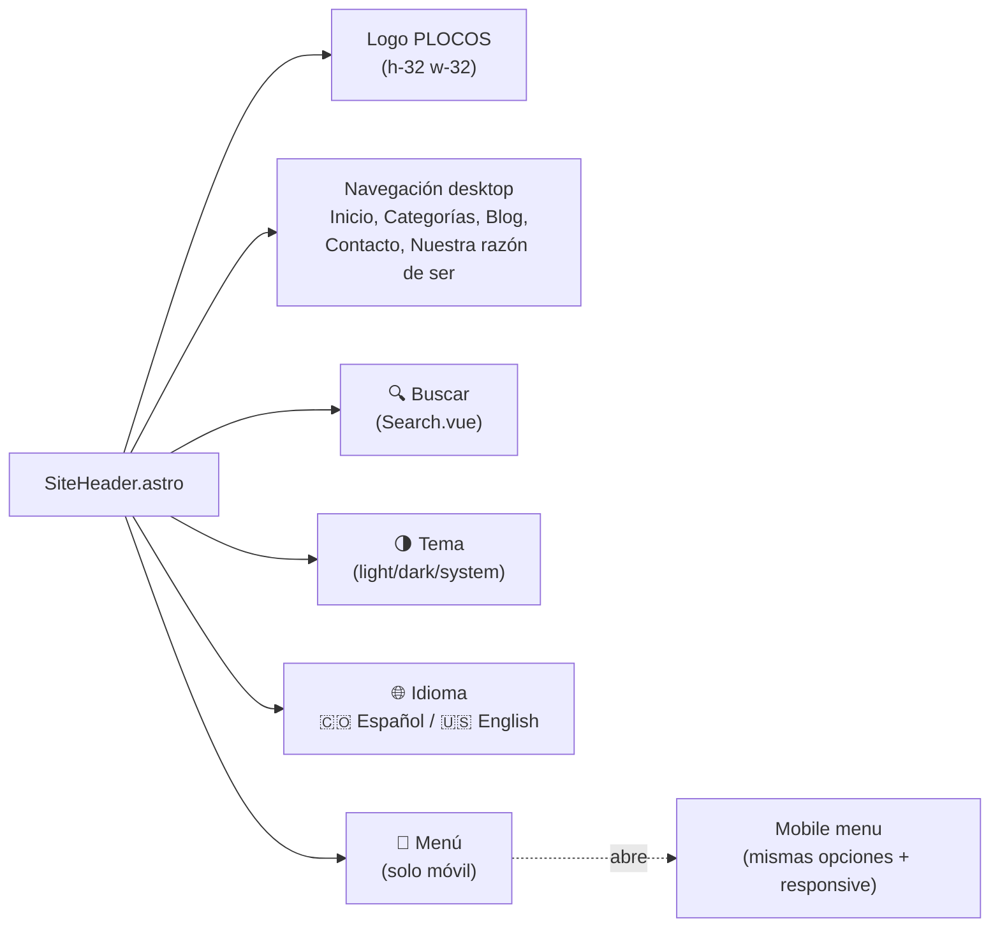

# Arquitectura de Información del Sitio

> Para el cliente y usuarios finales. Muestra qué páginas existen, cómo se conectan, y dónde está cada cosa.

```mermaid
graph TD
    Home["🏠 Inicio<br/>/ (es) / /en (en)"]
    Categorias["📂 Categorías<br/>/categorias/<br/>6 categorías"]
    Blog["📝 Blog<br/>/blog/<br/>~150 publicaciones"]
    About["🌟 Nuestra razón de ser<br/>/nuestra-razon-de-ser"]
    Contact["✉️ Contacto<br/>/contacto"]

    Terminos["📜 Términos<br/>/terminos<br/>8 secciones (I-VIII)"]
    Privacidad["🔒 Política de privacidad<br/>/privacidad<br/>Ley 1581/2012"]
    Cookies["🍪 Política de cookies<br/>/politica-de-cookies<br/>4 categorías"]

    AdminLogin["🔐 Admin Login<br/>/admin/login<br/>requiere token"]
    AdminComments["💬 Moderación<br/>/admin/comments<br/>requiere cookie válida"]

    Categorias --> Cat1[Ars et Scire]
    Categorias --> Cat2[Ex lateribus cogite]
    Categorias --> Cat3[Galería]
    Categorias --> Cat4[General]
    Categorias --> Cat5[Nomás que la vida]
    Categorias --> Cat6[ProsyArt]

    Cat3 -->|galería de obras| Gallery["/galeria/<br/>(futuro, AV collection)"]

    Blog --> Post["/blog/[slug]<br/>post individual con comments"]

    Terminos -.->|footer link| Footer["SiteFooter"]
    Privacidad -.->|footer link| Footer
    Cookies -.->|footer link| Footer
    Cookies -.->|banner "Gestionar cookies"| Footer

    Footer -.->|cookie consent re-open| Banner["CookieConsentBanner"]
    Banner -.->|aceptar/rechazar| LocalStorage["localStorage['astro-consent']"]

    Home --> Splash["🔞 Splash<br/>Sensitive Content Warning<br/>primera visita"]
    Splash -->|acknowledge| Home

    Home --> Terminos
    Home --> Privacidad
    Home --> Cookies

    Home --> Categorias
    Home --> Blog
    Home --> About
    Home --> Contact

    AdminLogin -->|cookie válida| AdminComments
    AdminComments -->|approve/delete| Blog
```

## Mapa de secciones dentro del Pacto de Lectura



## Navegación principal

El header de PLOCOS tiene estos elementos (responsive: desktop + móvil):



## Idiomas disponibles

| Locale | Prefijo en URL | Primary/Fallback | Status |
|---|---|---|---|
| Español (Colombia) | sin prefijo o `/es/` | primary | ✅ activo |
| Inglés | `/en/` | fallback | ✅ activo |

Cambio de idioma: click en la bandera en el header.

## Dónde encontrar cada cosa

| Quiero... | Ir a |
|---|---|
| Leer el pacto completo | `/terminos` (es) o `/en/terms` (en) |
| Ver mis datos personales tratados | `/privacidad` (es) o `/en/privacy` (en) |
| Ver qué cookies uso | `/politica-de-cookies` (es) o `/en/cookie-policy` (en) |
| Cambiar mi consentimiento de cookies | Click "Gestionar cookies" en el footer |
| Aprobar/eliminar comments | `/admin/login` con token, luego `/admin/comments` |
| Buscar un post | 🔍 en el header (desktop) o menú hamburguesa (móvil) |
| Cambiar idioma | 🇺🇸/🇨🇴 banderas en el header |
| Cambiar tema | 🌗 selector en el header |

Última actualización: 2026-09-05
