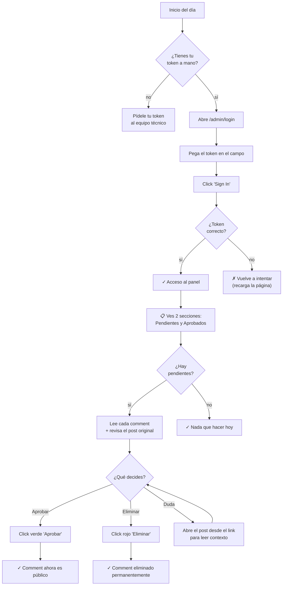
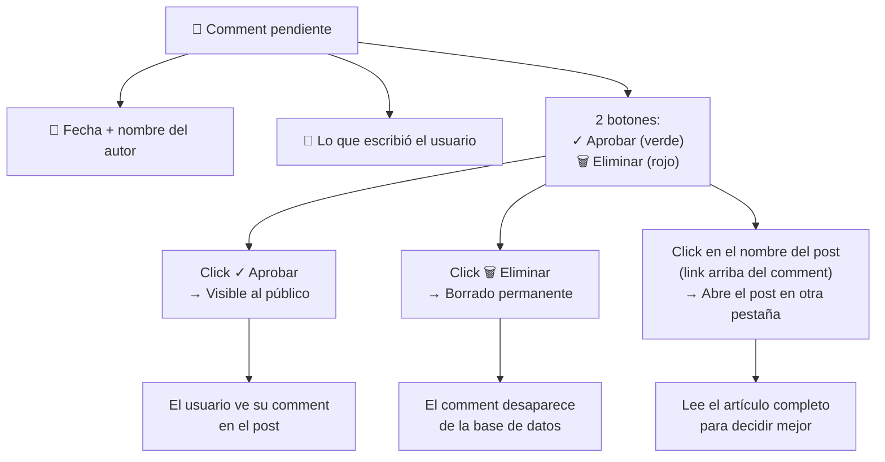
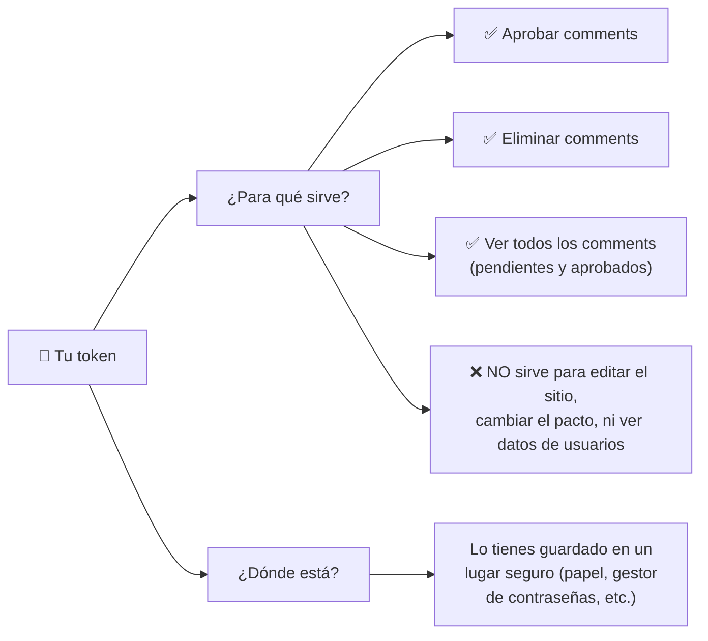
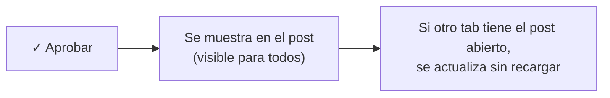
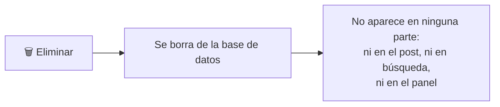

# Cómo Moderar Comentarios — Para el Cliente

> Esta guía está pensada para quien maneja el día a día del sitio (tú, el cliente). El equipo técnico se encarga de toda la configuración del servidor y las bases de datos. Tú solo necesitas saber cómo entrar al panel y aprobar o eliminar comments.

## Tu flujo diario

## Tu lista de pendientes

## Tu token de acceso

Tu token es una llave secreta que te da acceso al panel. Es como una contraseña, pero más larga.

**No tienes que preocuparte por dónde está guardado en el servidor.** El equipo técnico se encarga de eso. Si pierdes tu token, pídelo al equipo técnico y ellos te dan uno nuevo.

## Buenas prácticas de moderación

### ✅ Cosas que hacer

- **Lee el contexto antes de aprobar.** Si un comment dice algo que parece fuerte, abre el post desde el link para entender el contexto completo.
- **Sé consistente.** Si apruebas críticas constructivas, aprueba todas las similares.
- **Borra spam obvious** (links raros, texto sin sentido, otros idiomas).
- **Trabaja en sesiones cortas.** Si tienes muchos pendientes, tomate descansos.

### ❌ Cosas que NO hacer

- **No compartas tu token** con nadie por correo, chat, redes sociales, ni ningún medio inseguro.
- **No lo pegues en la URL** (el sistema lo protege automáticamente con cookies seguras).
- **No apruebes comments que rompan las reglas** del pacto (sección VI del pacto: spam, daño físico, ilegalidad, difamación sin fundamento).
- **No borres comments solo porque no estés de acuerdo.** El sitio es filosófico y las críticas son bienvenidas si son respetuosas.

## Qué pasa cuando apruebas un comment

## Qué pasa cuando eliminas un comment

## Si algo no funciona

| Síntoma | Qué hacer |
|---|---|
| "Failed to moderate" (mensaje en pantalla) | Recarga la página y vuelve a hacer login |
| No puedo entrar a `/admin/login` | Pide tu token al equipo técnico |
| La página de moderación no carga | Pide ayuda al equipo técnico |
| Olvidé mi token | Pide uno nuevo al equipo técnico |

**Regla simple**: si algo falla, no intentes arreglarlo tú. Avísale al equipo técnico. Ellos saben qué hacer.

## Anti-spam automático

El sistema ya bloquea la mayoría de bots automáticamente con un truco invisible. Tú no tienes que hacer nada especial — los bots ni siquiera llegan a tu panel.

## Resumen rápido

| Quiero... | Hago esto... |
|---|---|
| Entrar al panel | Abro `/admin/login`, pego mi token, click "Sign In" |
| Ver comments pendientes | Voy a `/admin/comments`, sección "Pendientes" |
| Aprobar un comment | Click en el botón verde ✓ |
| Eliminar un comment | Click en el botón rojo 🗑 |
| Ver el contexto del comment | Click en el link del post (arriba del comment) |
| Ver comments ya aprobados | Voy a `/admin/comments`, sección "Aprobados" |
| Cambiar mi token | Se lo pido al equipo técnico |

---

Si tienes preguntas sobre el **por qué** de las decisiones del sistema, pregúntale al equipo técnico. Esta guía es para tu uso diario, no para entender la implementación.

Última actualización: 2026-09-05
