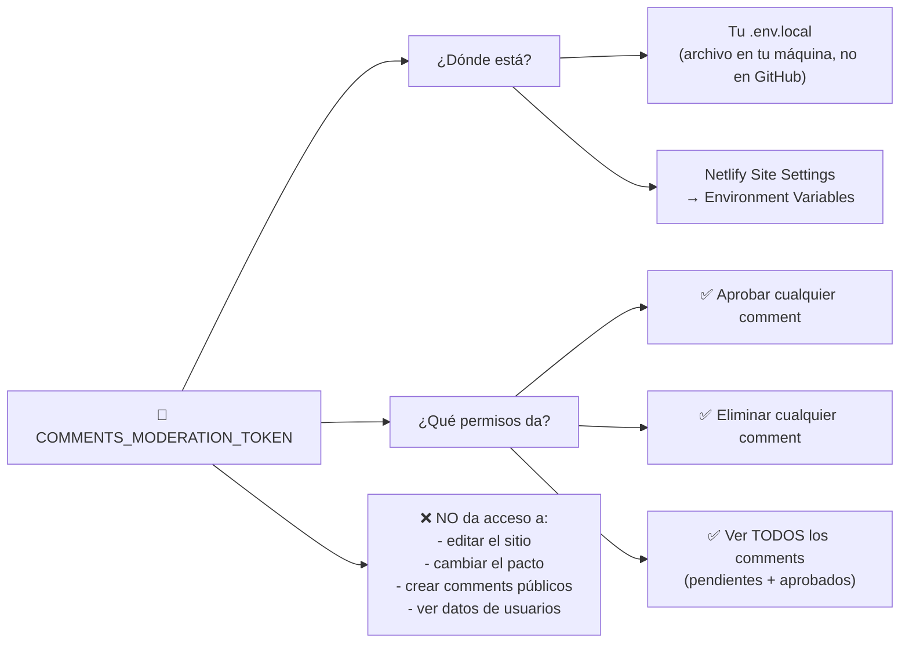
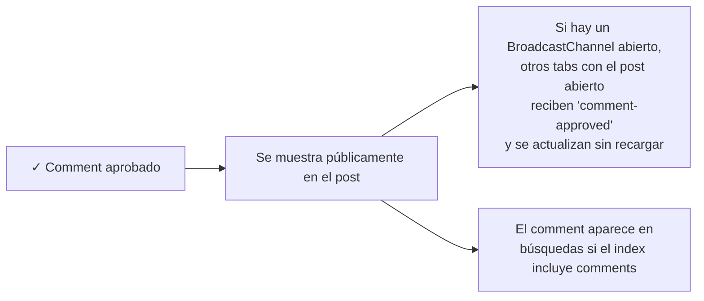
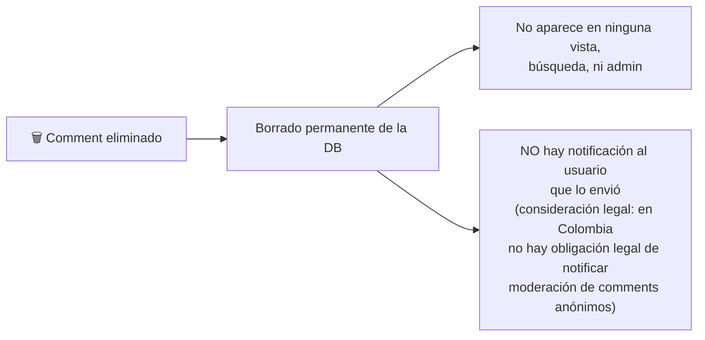
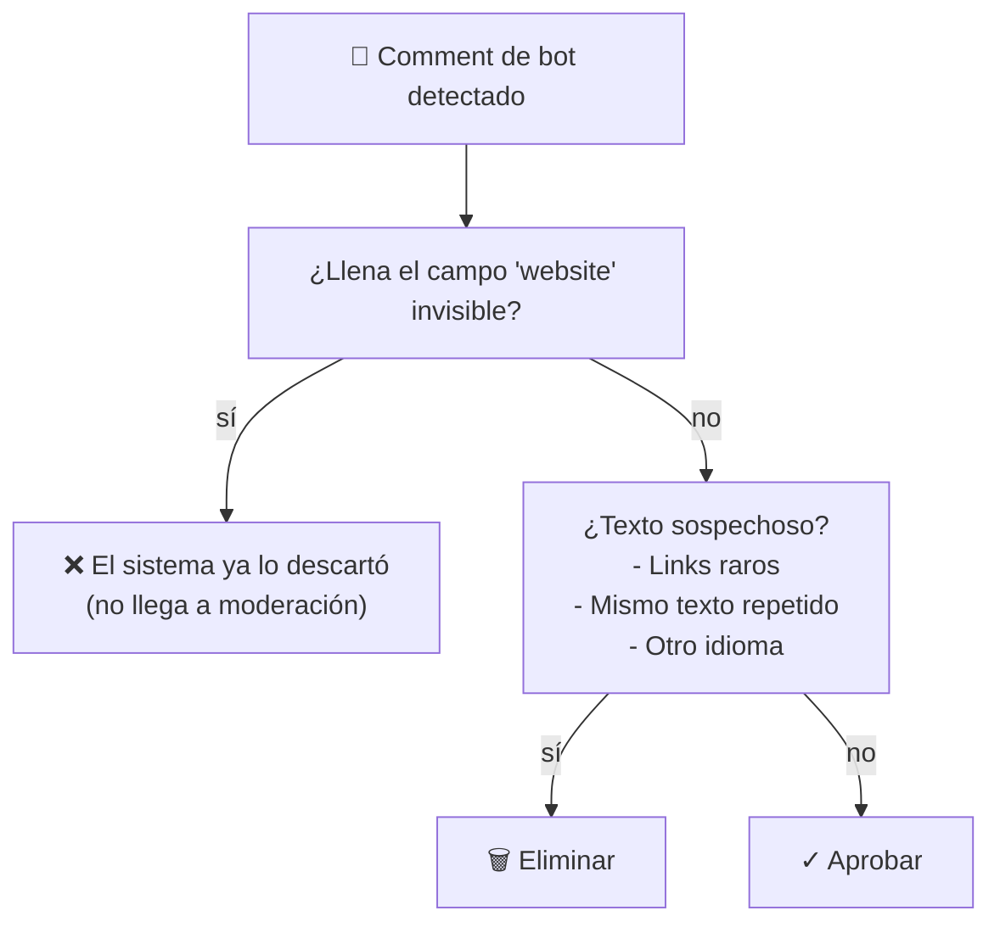

# Cómo Moderar Comentarios — Para el Cliente

> Esta guía está pensada para quien maneja el día a día del sitio (tú, el cliente). Si necesitas ayuda técnica más profunda, consulta `docs/diagramas/dev/comment-moderation.md`.

## Tu flujo diario

```mermaid
flowchart TD
    Start[Inicio del día] --> Check{Tienes token<br/>guardado?}
    Check -->|no sé| TokenInfo[Lee la sección "Token" abajo]
    Check -->|sí| Login["Ve a plocos.netlify.app/admin/login"]
    Login --> LoginForm["Pega el token en el campo"]
    LoginForm --> Submit["Click 'Sign In'"]

    Submit --> TokenCheck{Token<br/>correcto?}
    TokenCheck -->|sí| Redirect302[302 → /admin/comments]
    TokenCheck -->|no| ReloadLogin["Vuelve a /admin/login<br/>(recarga y reintenta)"]

    Redirect302 --> List["📋 Ves 2 listas:<br/>Pendientes (amarillo)<br/>Aprobados (verde)"]

    List --> Pending{Hay<br/>pendientes?}
    Pending -->|sí| Review[Lee cada comment<br/>+ contexto del post]
    Pending -->|no| Done["✓ Nada que hacer hoy"]

    Review --> Decide{Decisión}
    Decide -->|Aprobar| ClickApprove["Click 'Aprobar'"]
    Decide -->|Eliminar| ClickDelete["Click 'Eliminar'"]
    Decide -->|Duda| OpenPost["Abre el post<br/>(link en el comment)<br/>lee contexto"]

    ClickApprove --> Done2[Comment ahora visible al público]
    ClickDelete --> Done3[Comment borrado permanentemente]
    OpenPost --> Decide
```

## Anatomía de un comentario en moderación

```mermaid
graph TD
    Comment["📨 Comment item"] --> Meta["📅 Fecha + nombre + email (oculto)"]
    Comment --> Body["💬 Texto del comentario<br/>(escaped HTML, seguro de leer)"]
    Comment --> PostLink["🔗 Link al post original<br/>(data-post-slug attribute)"]
    Comment --> Buttons["Botones:<br/>✓ Aprobar (verde)<br/>🗑 Eliminar (rojo)"]

    Buttons --> Approve[approve-btn → POST /api/comments/moderate<br/>{ id, action: 'approve' }]
    Buttons --> Delete[delete-btn → POST /api/comments/moderate<br/>{ id, action: 'delete' }]

    Approve --> Success1[200 OK → comment pasa a aprobados]
    Delete --> Success2[200 OK → comment borrado]
    Approve -->|error| Error["❌ Toast: 'Failed to moderate'<br/>(probable: cookie expiró, re-login)"]
    Delete -->|error| Error
```

## El token



**El token es tu única llave al panel.** Si la pierdes, no hay "olvidé mi contraseña". Necesitas pedirle al equipo técnico un nuevo token y actualizarlo en:
1. Tu `.env.local` local
2. Netlify Environment Variables (site settings)

## Buenas prácticas

### ✅ Hacer
- **Lee el contexto** del post antes de aprobar. Si el comment dice "este post es pésimo", revisalo en contexto para decidir.
- **Sé consistente**. Si apruebas un tipo de crítica, aprueba todas las críticas similares.
- **Borra spam obvious** (links raros, texto sin sentido, otros idiomas).
- **Trabaja en sesiones cortas**. Si tienes 30+ pendientes, tomate un descanso.

### ❌ No hacer
- **No compartas el token** por correo, chat, redes sociales, o cualquier medio inseguro.
- **No lo subas a GitHub** ni a ningún sistema de versionado.
- **No lo pegues en la URL** (el sistema usa cookie httpOnly, no URL token, precisamente para esto).
- **No apruebes comments que rompan las reglas del pacto** (sección VI del pacto: spam, daño, ilegalidad, difamación sin fundamento).

## Qué pasa con los comments aprobados



## Qué pasa con los comments eliminados



## Estados de error y qué hacer

| Error | Causa probable | Solución |
|---|---|---|
| "Failed to moderate" (toast) | Cookie expirada o sesión perdida | Re-login en `/admin/login` |
| 401 Unauthorized (en consola) | Cookie inválida | Re-login |
| 404 al cargar `/admin/comments` | Token no configurado en Netlify | Pedir al equipo técnico que agregue `COMMENTS_MODERATION_TOKEN` a Netlify env vars |
| "ASTRO_DB_REMOTE_URL is not set" | DB no configurada en Netlify | Pedir al equipo técnico que configure Turso en Netlify env vars |

## Anti-spam: qué hacer con bots



El honeypot `website` es un campo que humanos no ven (CSS `position: absolute; left: -9999px`). Bots lo llenan. Si el sistema detecta que está lleno, el comment NO se guarda — nunca llega a tu panel.

## Resumen de comandos

| Quiero... | Voy a... |
|---|---|
| Entrar al panel | `/admin/login` + token |
| Ver pendientes | `/admin/comments` (sección "Pendientes") |
| Aprobar un comment | Click "Aprobar" |
| Eliminar un comment | Click "Eliminar" |
| Ver contexto de un comment | Click en el link del post (en el comment item) |
| Ver aprobados | `/admin/comments` (sección "Aprobados") |
| Cambiar mi token | Pedir al equipo técnico |

---

Si tienes dudas técnicas sobre cómo está implementado el sistema, consulta `docs/diagramas/dev/comment-moderation.md`.

Última actualización: 2026-09-05
