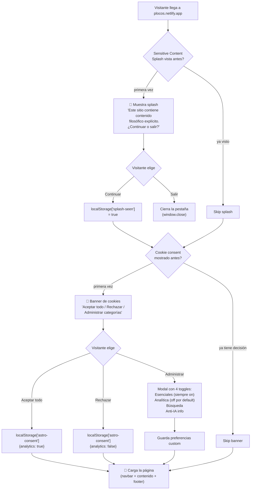
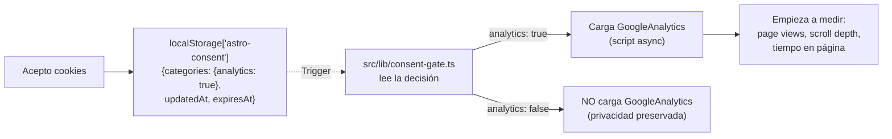
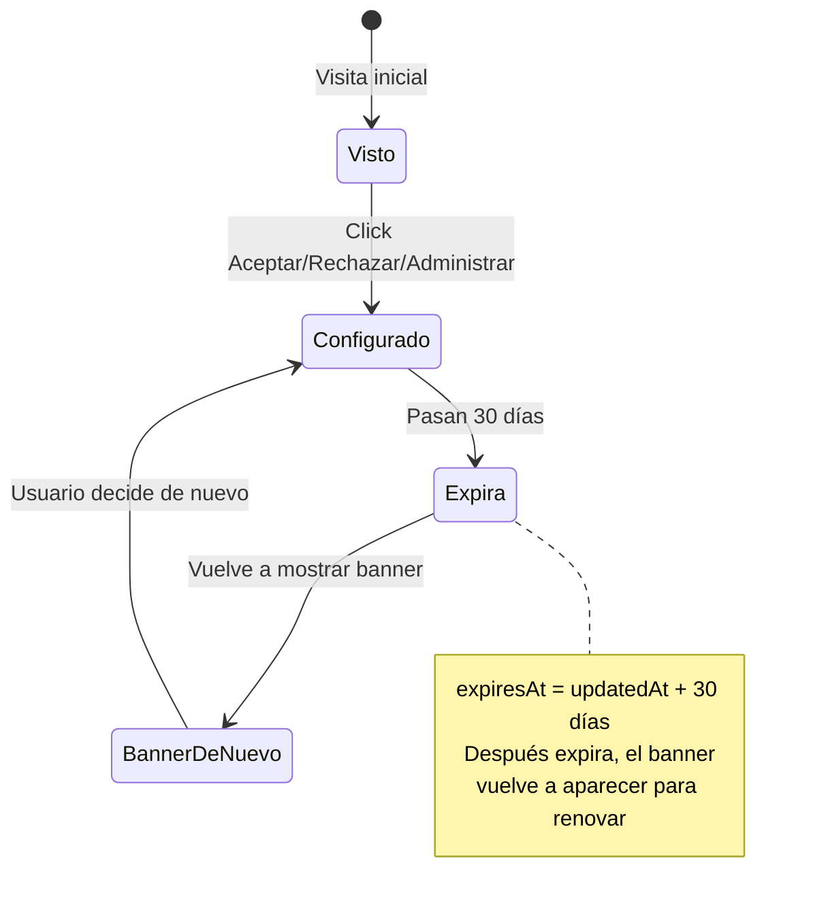
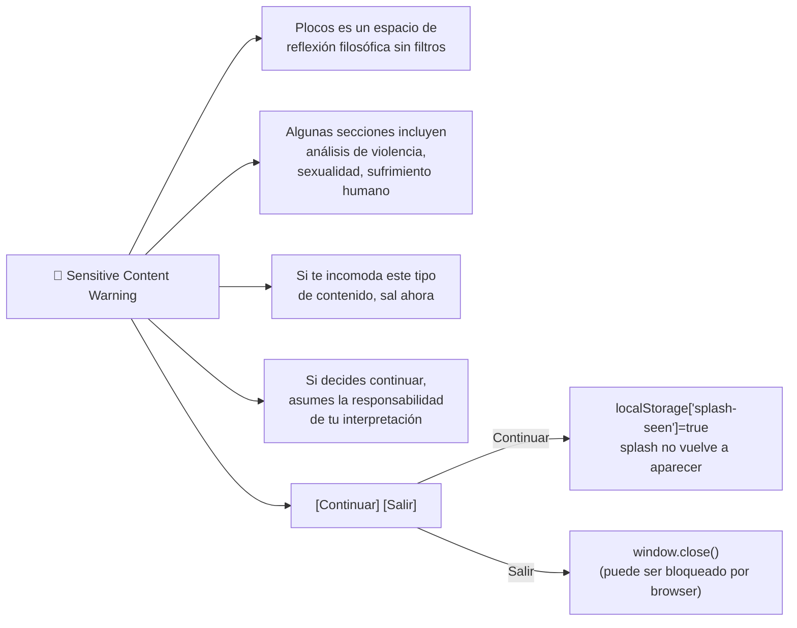

# Primera Visita al Sitio — Flujo del Usuario



## ¿Qué pasa cuando acepto cookies?



## ¿Qué pasa si rechazo?

- **Analítica**: NO se carga Google Analytics. No se miden page views.
- **Esenciales**: siempre activas (necesarias para que el sitio funcione).
- **Búsqueda**: si la rechazas, el índice de búsqueda puede no actualizarse localmente.
- **Anti-IA info**: no afecta funcionalidad, solo documenta el bloqueo de AI crawlers en robots.txt.

## ¿Cuándo vuelve a aparecer el banner?



## Splash: ¿qué es exactamente?

Es un modal que aparece ANTES de cualquier cookie. Reconoce al usuario como adulto informado.



El splash se renderiza en `BaseLayout.astro` antes del header. Usa `localStorage` (no cookie) para recordar la decisión.

## Navegación después del splash

```mermaid
graph LR
    Site[Sitio cargado] --> Header[SiteHeader]
    Site --> Main[Contenido principal]
    Site --> Footer[SiteFooter]

    Header --> Logo[Logo PLOCOS]
    Header --> Nav[Inicio | Categorías | Blog | Contacto | Razón de ser]
    Header --> Search[🔍 Buscar]
    Header --> Theme[🌗 Tema]
    Header --> Lang[🇨🇴 / 🇺🇸]

    Main --> Content[Contenido específico de la página]
    Footer --> Terminos[Términos]
    Footer --> Privacy[Privacidad]
    Footer --> Cookies[Política de cookies]
    Footer --> ManageCookies[Gestionar cookies]
    Footer --> RSS[RSS feed]
    Footer --> Social[Redes sociales]
```

Última actualización: 2026-09-05
